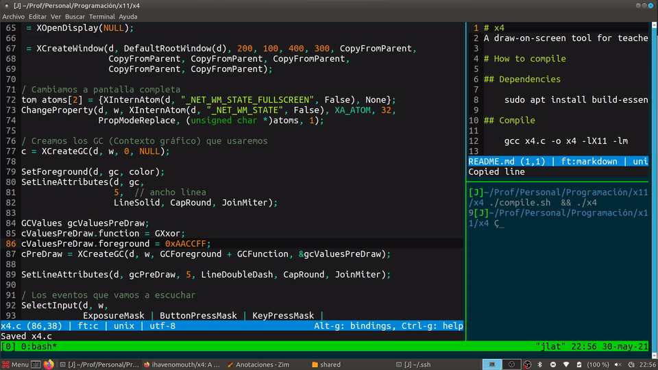

# x4

A draw-on-screen tool for teachers using Linux.

# How to compile

## Dependencies

    sudo apt install build-essential libx11-dev

## Compile

    gcc x4.c -o x4 -lX11 -lm

# How to use it

Create a keyboard shortcut to execute x4 (it depends on your window manager). I use Meta+4 as the shortcut.

Press c or control to draw a rectangle  
Press a or shift to draw an arrow  
Press b to change to color blue  
Press g to change to color green  
Press r to change to color red  
Press y to change to color yellow  
Press w to change to color white  
Press u to undo last drawing  

# TODO

- [ ] Cleaner code
- [ ] Better comments
- [ ] Use a Linter
- [x] Change the predraw color (currently bluish)
- [ ] Allow to change the border size
- [ ] Read configuration from files
- [ ] Save the drawing to a file
- [x] A screnshot in the Readme file
- [x] Undo feature

# ¿Cómo compilar?

## Dependencias

    sudo apt install build-essential libx11-dev

## Compilar

    gcc x4.c -o x4 -lX11 -lm

Alternativamente, se puede usar el shell script compile.sh por comodidad.

# Manual de uso

Crea un atajo de teclado en el gestor de ventana que utilices para ejecutar x4. En mi caso utilizo la tecla Meta+4 (Win+4).

Pulsa c o control para dibujar un rectángulo  
Pulsa a o shift para dibuajr una flecha  
Pulsa b para cambiar al color azul  
Pulsa g para cambiar al color verde  
Pulsa r para cambiar al color rojo  
Pulsa y para cambiar al color amarillo  
Pulsa w para cambiar al color blanco  
Pulsa u para deshacer el último dibujo

# TODO: Tareas por hacer

- [ ] Código más limpio
- [ ] Mejores comentarios
- [ ] Usar un Linter
- [x] Cambiar el color de predibujado (ahora mismo es azulado)
- [ ] Permitir cambiar el tamaño del borde
- [ ] Leer la configuración de un fichero
- [ ] Permitir guardar el dibujo en un fichero
- [x] Pantallazo en el fichero README
- [x] Añadir la característica de deshacer
